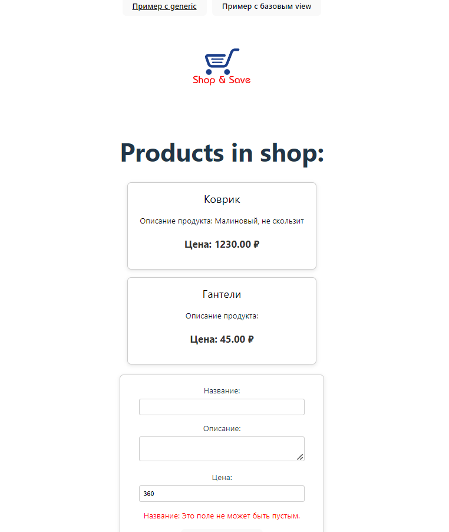
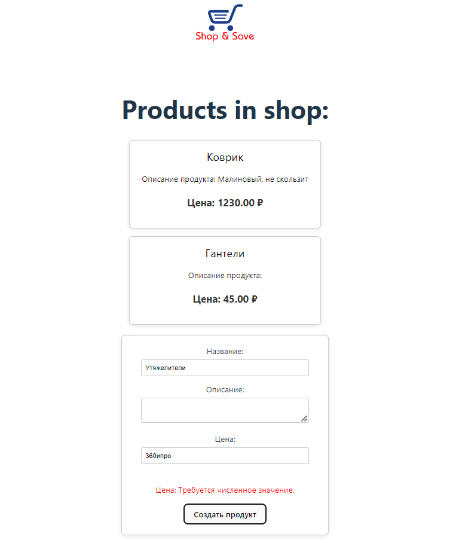
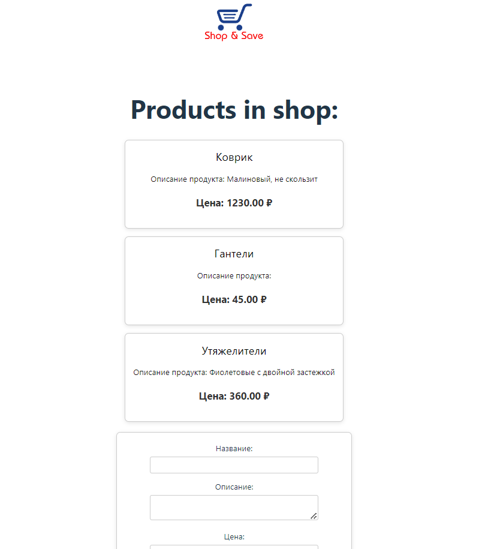

# Проект на Django REST Framework и React

## Описание проекта

Задание было реализовано с использованием базового ApiView и с использованием ListCreateApiView. В любом случае выполнены все необходимые проверки при создании объекта продукта, также предусмотрен корректный вывод списка продуктов. Фронтенд приложение выводит все сообщения об ощибках со стороны бэкенда.

## Установка

### Требования

- Python 3.x
- Django
- Django REST Framework
- Node.js 18.15 версии и выше
- npm или yarn

### Шаги по установке

1. **Клонируйте репозиторий:**

   ```bash
   git clone (ссылка на репозиторий)
   cd ваш_репозиторий
   ```
2. **Установите зависимости для бэкенда**
    ```bash
    cd backend
    pip install -r requirements.txt
    ```
3. **Примените миграции:**
    python manage.py migrate
4. ****
    ```bash
    python manage.py runserver
    ```
5. **Установите зависимости для фронтенда:**
    ```bash
    cd ../frontend
    yarn install
    ```
6. **Запустите сервер разработки React:**
    ```bash
    yarn dev
    ```

## Использование
После запуска серверов вы сможете получить доступ к приложению по адресу:
- Django API: http://localhost:8000/
- React приложение: http://localhost:5173/
```
testovoe_brendwall/
│
├── backend/                # Директория с бэкендом на Django
│   ├── backend/            # Основной проект Django
│   ├── api/                # Приложение API
│   │   ├── models.py       # Файл с моделью Product
│   │   ├── serializers.py  # Файл с сериалайзатором для view
│   │   ├── urls.py         # Файл с эндпоинтами проекта
│   │   ├── views.py        # Файл с View для обработки запросов REST API
│   └── manage.py           # Скрипт управления Django
│
└── frontend/               # Директория с фронтендом на React
    ├── src/                # Исходный код React приложения
    │   ├── components/     # Папка с компонентами React
    │   ├── styles/         # Папка со стилями
    │   ├── App.jsx         # Основной компонент приложения
    └── package.json        # Файл зависимостей для npm
```
## Пример работы приложения


